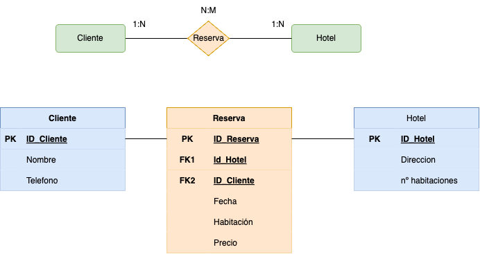

> **IMP**: Genera las claves necesarias para corregir las tablas resultantes.

## **Ejercicio 1: Lista de Productos**

### **Tabla Inicial: Productos**

| ID_Producto | Nombre_Producto | Proveedores      | Categoría   | Precio |
|------------|----------------|-----------------|------------|--------|
| 1          | Laptop         | Dell, HP        | Tecnología | 1000   |
| 2          | Mouse          | Logitech        | Accesorios | 25     |

### **Tareas:**

1. Aplicar **1FN**, eliminando los valores multivaluados en "Proveedores".

| ID_Producto | Nombre_Producto | Categoría   | Precio | Proveedor  |
|------------|----------------|------------|--------|-----------|
| 1          | Laptop         | Tecnología | 1000   | Dell      |
| 1          | Laptop         | Tecnología | 1000   | HP        |
| 2          | Mouse          | Accesorios | 25     | Logitech  |

2. Aplicar **2FN**, asegurando que cada campo dependa completamente de la clave primaria.

#### Tabla Productos
| ID_Producto | Nombre_Producto | Categoría   | Precio |
|------------|----------------|------------|--------|
| 1          | Laptop         | Tecnología | 1000   |
| 2          | Mouse          | Accesorios | 25     |

#### Tabla Proveedores_Productos
| ID_Producto | Proveedor  |
|------------|-----------|
| 1          | Dell      |
| 1          | HP        |
| 2          | Logitech  |

> Verifica generando el modelo Entidad/Relación

      
PULSA PARA VER LA SOLUCIÓN

     
   
  
   

---

## **Ejercicio 2: Pedidos de Clientes**

### **Tabla Inicial: Pedidos**

| ID_Pedido | Cliente   | Dirección       | Producto     | Cantidad | Precio |
|----------|----------|---------------|-------------|----------|--------|
| 101      | Juan Pérez | Calle 123     | Laptop      | 1        | 1000   |
| 102      | Ana López | Av. Central   | Teclado     | 2        | 50     |

### **Tareas:**

1. Aplicar **1FN**, separando valores repetidos y creando nuevas tablas si es necesario.
**La tabla ya cumple la 1FN**.
2. Aplicar **2FN**, asegurando que las dependencias parciales sean eliminadas.

#### Tabla Pedidos
| ID_Pedido | Cliente    | Dirección    |
|----------|-----------|-------------|
| 101      | Juan Pérez | Calle 123   |
| 102      | Ana López  | Av. Central |

#### Tabla Pedidos_Productos
| ID_Pedido | Producto | Cantidad | Precio |
|----------|---------|---------|--------|
| 101      | Laptop  | 1       | 1000   |
| 102      | Teclado | 2       | 50     |

> Verifica generando el modelo Entidad/Relación

      
PULSA PARA VER LA SOLUCIÓN

     
   
  
   

---

## **Ejercicio 3: Registro de Empleados**

### **Tabla Inicial: Empleados**

| ID_Empleado | Nombre     | Teléfonos         | Departamento |
|------------|------------|------------------|--------------|
| 1          | Carlos R.  | 12345, 67890     | Ventas       |
| 2          | Laura M.   | 54321            | Finanzas     |

### **Tareas:**

1. Aplicar **1FN**, eliminando los valores multivaluados en "Teléfonos".

| ID_Empleado | Nombre   | Departamento | Teléfono |
|------------|---------|-------------|---------|
| 1          | Carlos R. | Ventas      | 12345   |
| 1          | Carlos R. | Ventas      | 67890   |
| 2          | Laura M.  | Finanzas    | 54321   |

2. Aplicar **2FN**, asegurando que cada atributo dependa completamente de la clave primaria.

#### Tabla Empleados
| ID_Empleado | Nombre   | Departamento |
|------------|---------|-------------|
| 1          | Carlos R. | Ventas      |
| 2          | Laura M.  | Finanzas    |

#### Tabla Empleados_Teléfonos
| ID_Empleado | Teléfono |
|------------|---------|
| 1          | 12345   |
| 1          | 67890   |
| 2          | 54321   |

> Verifica generando el modelo Entidad/Relación

      
PULSA PARA VER LA SOLUCIÓN

     
   
  
   

---

## **Ejercicio 4: Reservas de Hotel**

### **Tabla Inicial: Reservas**

| ID_Reserva | Cliente    | Habitación | Fechas              | Precio |
|------------|-----------|------------|---------------------|--------|
| 5001      | Pedro G.  | 101        | 01/02, 02/02, 03/02 | 300    |
| 5002      | María T.  | 202        | 10/03, 11/03       | 200    |

### **Tareas:**

1. Aplicar **1FN**, eliminando los valores multivaluados en "Fechas".

| ID_Reserva | Cliente  | Habitación | Fecha   | Precio |
|-----------|---------|-----------|--------|--------|
| 5001      | Pedro G. | 101       | 01/02  | 300    |
| 5001      | Pedro G. | 101       | 02/02  | 300    |
| 5001      | Pedro G. | 101       | 03/02  | 300    |
| 5002      | María T. | 202       | 10/03  | 200    |
| 5002      | María T. | 202       | 11/03  | 200    |

2. Aplicar **2FN**, asegurando que las dependencias parciales sean eliminadas.

#### Tabla Reservas
| ID_Reserva | Cliente  | Habitación |
|-----------|---------|-----------|
| 5001      | Pedro G. | 101       |
| 5002      | María T. | 202       |

#### Tabla Reservas_Fechas
| ID_Reserva | Fecha   | Precio |
|-----------|--------|--------|
| 5001      | 01/02  | 300    |
| 5001      | 02/02  | 300    |
| 5001      | 03/02  | 300    |
| 5002      | 10/03  | 200    |
| 5002      | 11/03  | 200    |

> Verifica generando el modelo Entidad/Relación

      
PULSA PARA VER LA SOLUCIÓN

     
   
  
   

---

## **Ejercicio 5: Inscripciones a Cursos**

### **Tabla Inicial: Inscripciones**

| ID_Inscripción | Estudiante | Curso        | Profesor    | Horarios |
|---------------|------------|--------------|------------|----------|
| 3001         | Luis R.    | Matemáticas  | Prof. Pérez | Lunes 10AM, Miércoles 2PM |
| 3002         | Ana S.     | Física       | Prof. Gómez | Martes 3PM |

### **Tareas:**

1. Aplicar **1FN**, eliminando valores multivaluados en "Horarios".

| ID_Inscripción | Estudiante | Curso       | Profesor    | Horario        |
|---------------|------------|-------------|-------------|---------------|
| 3001         | Luis R.    | Matemáticas | Prof. Pérez | Lunes 10AM    |
| 3001         | Luis R.    | Matemáticas | Prof. Pérez | Miércoles 2PM |
| 3002         | Ana S.     | Física      | Prof. Gómez | Martes 3PM    |

2. Aplicar **2FN**, asegurando que cada campo dependa completamente de la clave primaria.

#### Tabla Inscripciones

| ID_Inscripción | Estudiante | Curso       | Profesor    |
|---------------|------------|-------------|-------------|
| 3001         | Luis R.    | Matemáticas | Prof. Pérez |
| 3002         | Ana S.     | Física      | Prof. Gómez |

#### Tabla Inscripciones_Horarios

| ID_Inscripción | Horario        |
|---------------|---------------|
| 3001         | Lunes 10AM    |
| 3001         | Miércoles 2PM |
| 3002         | Martes 3PM    |

> Verifica generando el modelo Entidad/Relación

      
PULSA PARA VER LA SOLUCIÓN

     
   
  
   

---

## **Ejercicio 6: Ventas de Tienda**

### **Tabla Inicial: Ventas**

| ID_Venta | Cliente    | Productos Comprados | Total |
|----------|------------|---------------------|-------|
| 8001     | Juan P.   | Celular, Funda      | 500   |
| 8002     | Andrea M. | Laptop              | 1000  |

### **Tareas:**

1. Aplicar **1FN**, separando valores multivaluados en "Productos Comprados".

| ID_Venta | Cliente  | Producto  | Total |
|---------|---------|-----------|------|
| 8001    | Juan P. | Celular   | 500  |
| 8001    | Juan P. | Funda     | 500  |
| 8002    | Andrea M. | Laptop | 1000 |

2. Aplicar **2FN**, asegurando que cada atributo dependa completamente de la clave primaria.

#### Tabla Ventas

| ID_Venta | Cliente  | Total |
|---------|---------|------|
| 8001    | Juan P. | 500  |
| 8002    | Andrea M. | 1000 |

#### Tabla Ventas_Productos

| ID_Venta | Producto |
|---------|-----------|
| 8001    | Celular  |
| 8001    | Funda    |
| 8002    | Laptop   |
> Verifica generando el modelo Entidad/Relación

      
PULSA PARA VER LA SOLUCIÓN

     
   
  
   

---

## **Ejercicio 7: Biblioteca de Libros**

### **Tabla Inicial: Libros**

| ID_Libro | Título | Autores          | Género  |
|----------|--------|-----------------|---------|
| 101      | El Quijote | Cervantes   | Novela  |
| 102      | 1984       | Orwell       | Ciencia Ficción |

### **Tareas:**

1. Aplicar **1FN**, eliminando valores multivaluados en "Autores".

| ID_Libro | Título     | Autor      | Género          |
|---------|-----------|------------|---------------|
| 101     | El Quijote | Cervantes  | Novela        |
| 102     | 1984      | Orwell     | Ciencia Ficción |

2. Aplicar **2FN**, asegurando que cada atributo dependa completamente de la clave primaria.

#### Tabla Libros

| ID_Libro | Título     | Género          |
|---------|-----------|---------------|
| 101     | El Quijote | Novela        |
| 102     | 1984      | Ciencia Ficción |

#### Tabla Libros_Autores

| ID_Libro | Autor     |
|---------|------------|
| 101     | Cervantes |
| 102     | Orwell    |

> Verifica generando el modelo Entidad/Relación

      
PULSA PARA VER LA SOLUCIÓN

     
   
  
   

---

## **Ejercicio 8: Facturación de Servicios**

### **Tabla Inicial: Facturas**

| ID_Factura | Cliente   | Servicios Contratados | Costo Total |
|------------|-----------|----------------------|-------------|
| 9001       | Juan P.   | Internet, TV        | 50          |
| 9002       | Ana M.    | Teléfono            | 20          |

### **Tareas:**

1. Aplicar **1FN**, separando valores multivaluados en "Servicios Contratados".

| ID_Factura | Cliente  | Servicio  | Costo Total |
|-----------|---------|-----------|-------------|
| 9001      | Juan P. | Internet  | 50          |
| 9001      | Juan P. | TV        | 50          |
| 9002      | Ana M.  | Teléfono  | 20          |

2. Aplicar **2FN**, asegurando que cada atributo dependa completamente de la clave primaria.

#### Tabla Facturas

| ID_Factura | Cliente  | Costo Total |
|-----------|---------|-------------|
| 9001      | Juan P. | 50          |
| 9002      | Ana M.  | 20          |

#### Tabla Facturas_Servicios

| ID_Factura | Servicio  |
|-----------|-----------|
| 9001      | Internet  |
| 9001      | TV        |
| 9002      | Teléfono  |

> Verifica generando el modelo Entidad/Relación

      
PULSA PARA VER LA SOLUCIÓN

     
   
  
   

---

## **Ejercicio 9: Gestión de Vehículos**

### **Tabla Inicial: Vehículos**

| ID_Vehículo | Marca   | Modelos          | Año |
|------------|--------|----------------|-----|
| 5001       | Toyota  | Corolla, Yaris  | 2022 |
| 5002       | Honda   | Civic          | 2023 |

### **Tareas:**

1. Aplicar **1FN**, eliminando valores multivaluados en "Modelos".

| ID_Vehículo | Marca  | Modelo   | Año  |
|-----------|--------|---------|------|
| 5001      | Toyota | Corolla | 2022 |
| 5001      | Toyota | Yaris   | 2022 |
| 5002      | Honda  | Civic   | 2023 |

2. Aplicar **2FN**, asegurando que cada atributo dependa completamente de la clave primaria.

#### Tabla Vehículos

| ID_Vehículo | Marca  | Año  |
|-----------|--------|------|
| 5001      | Toyota | 2022 |
| 5002      | Honda  | 2023 |

#### Tabla Vehículos_Modelos

| ID_Vehículo | Modelo  |
|-----------|---------|
| 5001      | Corolla |
| 5001      | Yaris   |
| 5002      | Civic   |

> Verifica generando el modelo Entidad/Relación

      
PULSA PARA VER LA SOLUCIÓN

     
   
  
   

---

## **Ejercicio 10: Gestión de Proyectos**

### **Tabla Inicial: Proyectos**

| ID_Proyecto | Nombre       | Miembros        | Presupuesto |
|------------|-------------|----------------|------------|
| 7001       | Web App     | Juan, Ana      | 5000       |
| 7002       | E-commerce  | Pedro, María   | 10000      |

### **Tareas:**

1. Aplicar **1FN**, eliminando valores multivaluados en "Miembros".

| ID_Proyecto | Nombre     | Miembro | Presupuesto |
|-----------|-----------|--------|------------|
| 7001      | Web App   | Juan   | 5000       |
| 7001      | Web App   | Ana    | 5000       |
| 7002      | E-commerce | Pedro  | 10000      |
| 7002      | E-commerce | María  | 10000      |

2. Aplicar **2FN**, asegurando que cada atributo dependa completamente de la clave primaria.

#### Tabla Proyectos

| ID_Proyecto | Nombre     | Presupuesto |
|-----------|-----------|------------|
| 7001      | Web App   | 5000       |
| 7002      | E-commerce | 10000      |

#### Tabla Proyectos_Miembros

| ID_Proyecto | Miembro |
|-----------|--------|
| 7001      | Juan   |
| 7001      | Ana    |
| 7002      | Pedro  |
| 7002      | María  |

> Verifica generando el modelo Entidad/Relación

      
PULSA PARA VER LA SOLUCIÓN

     
   
  
   

 
