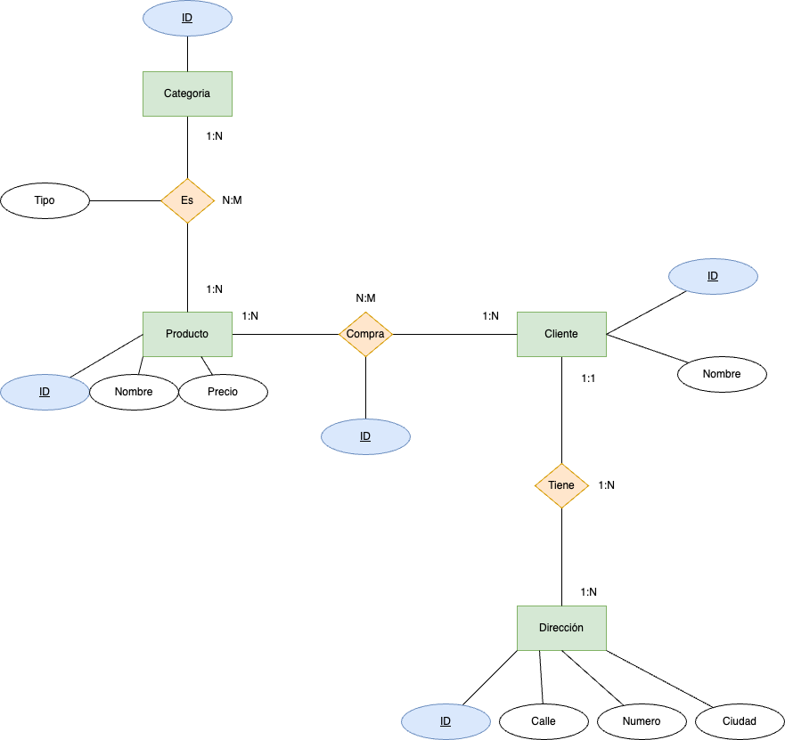

# 

La siguiente tabla muestra la información de una tienda con sus productos.

## Base de Datos No Normalizada: Tienda

| ProductoID | Nombre          | Categorias                  | Precio | ClienteID | NombreCliente | DireccionesEnvio                    |
|------------|-----------------|-----------------------------|--------|-----------|---------------|-------------------------------------|
| 1          | Laptop HP       | Electrónicos, Informática   | 800    | 101       | Juan          | Calle 1, Ciudad A / Calle 2, Ciudad A |
| 2          | Camiseta Nike    | Ropa, Deportes              | 30     | 102       | María         | Calle 3, Ciudad B                    |
| 3          | Libro "Dune"     | Libros, Ciencia Ficción     | 20     | 101       | Juan          | Calle 1, Ciudad A                     |

Se pide:

- Verifica y transforma a __1FN__ justificando la respuesta.
## Base de Datos en 1FN

| ProductoID | Nombre         | Categoría                | Precio | ClienteID | NombreCliente | DireccionesEnvio            |
|------------|----------------|--------------------------|--------|-----------|---------------|-----------------------------|
| 1          | Laptop HP      | Electrónicos             | 800    | 101       | Juan          | Calle 1, Ciudad A           |
| 1          | Laptop HP      | Informática              | 800    | 101       | Juan          | Calle 2, Ciudad A           |
| 2          | Camiseta Nike  | Ropa                     | 30     | 102       | María         | Calle 3, Ciudad B           |
| 2          | Camiseta Nike  | Deportes                 | 30     | 102       | María         | Calle 3, Ciudad B           |
| 3          | Libro "Dune"   | Libros                   | 20     | 101       | Juan          | Calle 1, Ciudad A           |
| 3          | Libro "Dune"   | Ciencia Ficción          | 20     | 101       | Juan          | Calle 1, Ciudad A           |

---

- Verifica y transforma a __2FN__ justificando la respuesta.
### Tabla Productos

| ProductoID | Nombre         | Precio | Categoría                |
|------------|----------------|--------|--------------------------|
| 1          | Laptop HP      | 800    | Electrónicos             |
| 1          | Laptop HP      | 800    | Informática              |
| 2          | Camiseta Nike  | 30     | Ropa                     |
| 2          | Camiseta Nike  | 30     | Deportes                 |
| 3          | Libro "Dune"   | 20     | Libros                   |
| 3          | Libro "Dune"   | 20     | Ciencia Ficción          |

### Tabla Clientes

| ClienteID | NombreCliente | DireccionesEnvio            |
|-----------|---------------|-----------------------------|
| 101       | Juan          | Calle 1, Ciudad A           |
| 101       | Juan          | Calle 2, Ciudad A           |
| 102       | María         | Calle 3, Ciudad B           |

---

- Verifica y transforma a __3FN__ justificando la respuesta.

## Base de Datos en 3FN

### Tabla Productos

| ProductoID | Nombre         | Precio |
|------------|----------------|--------|
| 1          | Laptop HP      | 800    |
| 1          | Laptop HP      | 800    |
| 2          | Camiseta Nike  | 30     |
| 2          | Camiseta Nike  | 30     |
| 3          | Libro "Dune"   | 20     |
| 3          | Libro "Dune"   | 20     |

### Tabla Categoria

| Categoría                |
|--------------------------|
| Electrónicos             |
| Informática              |
| Ropa                     |
| Deportes                 |
| Libros                   |
| Ciencia Ficción          |

### Tabla Clientes

| ClienteID | NombreCliente |  
|-----------|---------------|  
| 101       | Juan          |  
| 102       | María         |  

### Tabla Direcciones

 DireccionesEnvio            |
|-----------------------------|
| Calle 1, Ciudad A           |
| Calle 2, Ciudad A           |
| Calle 3, Ciudad B           |

      
PULSA PARA VER EL ESQUEMA E/R

     
   
  
   

---

 
