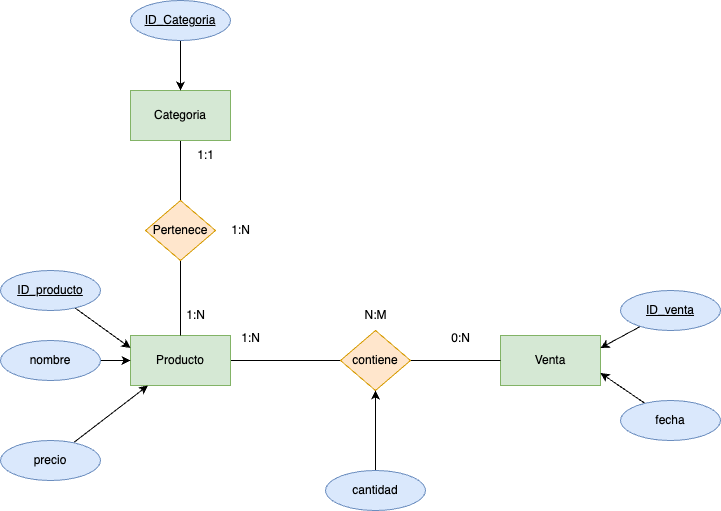
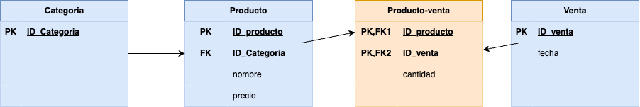

## Objetivo

_Practicar la creación y manipulación de una base de datos SQLite3 desde la línea de comandos_.

## Descripción

## Pasos:

### Paso 1: Creación de la BBDD

Crea con el siguente contenido el fichero __supermercado-dump.sql__.

```sql
CREATE TABLE productos (
    id INTEGER PRIMARY KEY,
    nombre TEXT,
    categoria TEXT,
    precio REAL
);

CREATE TABLE ventas (
    id INTEGER PRIMARY KEY,
    id_producto INTEGER,
    cantidad INTEGER,
    fecha DATE,
    FOREIGN KEY (id_producto) REFERENCES productos(id)
);

INSERT INTO productos (id, nombre, categoria, precio) VALUES 
    (1, 'Arroz', 'Alimentos', 2.5),
    (2, 'Leche', 'Lácteos', 1.8),
    (3, 'Pan', 'Panadería', 1.2),
    (4, 'Manzanas', 'Frutas', 3.0),
    (5, 'Pollo', 'Carnes', 5.5),
    (6, 'Huevos', 'Lácteos', 1.0),
    (7, 'Yogurt', 'Lácteos', 2.0),
    (8, 'Tomates', 'Verduras', 2.2),
    (9, 'Queso', 'Lácteos', 4.0),
    (10, 'Cereal', 'Desayuno', 3.5),
    (11, 'Papel Higiénico', 'Hogar', 1.5),
    (12, 'Cepillo de Dientes', 'Higiene', 2.0),
    (13, 'Detergente', 'Limpieza', 2.8),
    (14, 'Galletas', 'Snacks', 1.7),
    (15, 'Aceite de Oliva', 'Cocina', 4.5),
    (16, 'Café', 'Bebidas', 5.0),
    (17, 'Sopa enlatada', 'Conservas', 2.3),
    (18, 'Jabón de Baño', 'Higiene', 1.2),
    (19, 'Botellas de Agua', 'Bebidas', 1.0),
    (20, 'Cerveza', 'Bebidas', 3.8);

INSERT INTO ventas (id_producto, cantidad, fecha) VALUES 
    (1, 5, '2024-01-17'),
    (2, 3, '2024-01-17'),
    (4, 2, '2024-01-17'),
    (5, 1, '2024-01-17'),
    (6, 10, '2024-01-18'),
    (8, 4, '2024-01-18'),
    (10, 2, '2024-01-18'),
    (14, 7, '2024-01-19'),
    (16, 3, '2024-01-19'),
    (18, 6, '2024-01-20');
```
  
### Paso 2 Lectura del fichero sql.

Entra en sqlite a través del siguiente comando:

```sql
sqlite3 tarea4.db 
```

Haciendo un __.read__ del fichero __sql__, de nombre __supermercado-db.sql__, realiza la creación e inserción de información de la __BBDD__.

### Paso 3: Responde a las siguientes cuestiones

- Realiza el diagrama __ER__ de la __BBDD__ supermercado.

- Realiza el diagrama __MR__ de la __BBDD__ supermercado.

- Indica si la BBDD esta __normalizada__ hasta la 3ª forma normal, justificando la respuesta.
- 1ª Forma Normal (1NF)
    Para cumplir con la 1NF:

        Todos los valores de las columnas deben ser atómicos.
        No debe haber grupos repetitivos.

    -Verificación:

        En las tablas productos y ventas, todos los valores de las columnas son atómicos y no hay grupos repetitivos.

✔ Cumple la 1NF.

- 2ª Forma Normal (2NF)
    Para cumplir con la 2NF:

        Debe cumplir la 1NF.
        Todos los atributos no clave deben depender completamente de la clave primaria.

     -Verificación:
     
        En la tabla productos, nombre, categoria y precio dependen completamente del id.
        En la tabla ventas, id_producto, cantidad y fecha dependen completamente del id.

✔ Cumple la 2NF.

-3ª Forma Normal (3NF)
   Para cumplir con la 2NF:

        Debe cumplir la 1NF.
        Todos los atributos no clave deben depender completamente de la clave primaria.

-Verificación:
     
    En la tabla productos, nombre y precio dependen completamente de id y no hay dependencias transitivas entre nombre, id_categoria y precio.
    En la tabla ventas, id_producto, cantidad y fecha dependen completamente de id y no hay dependencias transitivas entre id_producto, cantidad y fecha.
    
No cumple la 3NF.
    

### Paso 4: Responde a las siguientes cuestiones

Realiza las siguientes consultas, y muestra el resultado obtenido:

- Mostrar todos los productos de la categoría "Bebidas".
```sql
SELECT * FROM productos WHERE categoria = 'Bebidas';
```

**Resultado:**

<details>
<summary>PULSA PARA VER EL RESULTADO DE LA TABLA</summary>
</br>

    +----+------------------+-----------+--------+
    | id |      nombre      | categoria | precio |
    +----+------------------+-----------+--------+
    | 16 | Café             | Bebidas   | 5.0    |
    | 19 | Botellas de Agua | Bebidas   | 1.0    |
    | 20 | Cerveza          | Bebidas   | 3.8    |
    +----+------------------+-----------+--------+
    
</br>
</details>
</br>

- Listar los productos ordenados por precio de forma descendente.
```sql
SELECT * FROM productos ORDER BY precio DESC;
```

**Resultado:**

<details>
<summary>PULSA PARA VER EL RESULTADO DE LA TABLA</summary>
</br>

    +----+--------------------+-----------+--------+
    | id |       nombre       | categoria | precio |
    +----+--------------------+-----------+--------+
    | 5  | Pollo              | Carnes    | 5.5    |
    | 16 | Café               | Bebidas   | 5.0    |
    | 15 | Aceite de Oliva    | Cocina    | 4.5    |
    | 9  | Queso              | Lácteos   | 4.0    |
    | 20 | Cerveza            | Bebidas   | 3.8    |
    | 10 | Cereal             | Desayuno  | 3.5    |
    | 4  | Manzanas           | Frutas    | 3.0    |
    | 13 | Detergente         | Limpieza  | 2.8    |
    | 1  | Arroz              | Alimentos | 2.5    |
    | 17 | Sopa enlatada      | Conservas | 2.3    |
    | 8  | Tomates            | Verduras  | 2.2    |
    | 7  | Yogurt             | Lácteos   | 2.0    |
    | 12 | Cepillo de Dientes | Higiene   | 2.0    |
    | 2  | Leche              | Lácteos   | 1.8    |
    | 14 | Galletas           | Snacks    | 1.7    |
    | 11 | Papel Higiénico    | Hogar     | 1.5    |
    | 3  | Pan                | Panadería | 1.2    |
    | 18 | Jabón de Baño      | Higiene   | 1.2    |
    | 6  | Huevos             | Lácteos   | 1.0    |
    | 19 | Botellas de Agua   | Bebidas   | 1.0    |
    +----+--------------------+-----------+--------+
    
</br>
</details>
</br>

- Calcular el precio total de todos los productos en la tabla "productos".
```sql
SELECT SUM(precio) AS total_precio FROM productos;
```

**Resultado:**

<details>
<summary>PULSA PARA VER EL RESULTADO DE LA TABLA</summary>
</br>

    +--------------+
    | total_precio |
    +--------------+
    | 52.5         |
    +--------------+
    
</br>
</details>
</br>

- Encontrar los productos con un nombre que contenga la letra 'a'.
```sql
SELECT * FROM productos WHERE nombre LIKE '%a%';
```

**Resultado:**

<details>
<summary>PULSA PARA VER EL RESULTADO DE LA TABLA</summary>
</br>

    +----+------------------+-----------+--------+
    | id |      nombre      | categoria | precio |
    +----+------------------+-----------+--------+
    | 1  | Arroz            | Alimentos | 2.5    |
    | 3  | Pan              | Panadería | 1.2    |
    | 4  | Manzanas         | Frutas    | 3.0    |
    | 8  | Tomates          | Verduras  | 2.2    |
    | 10 | Cereal           | Desayuno  | 3.5    |
    | 11 | Papel Higiénico  | Hogar     | 1.5    |
    | 14 | Galletas         | Snacks    | 1.7    |
    | 15 | Aceite de Oliva  | Cocina    | 4.5    |
    | 16 | Café             | Bebidas   | 5.0    |
    | 17 | Sopa enlatada    | Conservas | 2.3    |
    | 18 | Jabón de Baño    | Higiene   | 1.2    |
    | 19 | Botellas de Agua | Bebidas   | 1.0    |
    | 20 | Cerveza          | Bebidas   | 3.8    |
    +----+------------------+-----------+--------+
    
</br>
</details>
</br>


- Obtener la cantidad total de productos vendidos en todas las fechas.
```sql
SELECT SUM(cantidad) AS total_vendido FROM ventas;
```

**Resultado:**

<details>
<summary>PULSA PARA VER EL RESULTADO DE LA TABLA</summary>
</br>

    +---------------+
    | total_vendido |
    +---------------+
    | 43            |
    +---------------+   
    
</br>
</details>
</br>


- Encontrar el producto más caro en cada categoría.
```sql
SELECT categoria, nombre, MAX(precio) AS precio_maximo
FROM productos
GROUP BY categoria;
```

**Resultado:**

<details>
<summary>PULSA PARA VER EL RESULTADO DE LA TABLA</summary>
</br>

    +-----------+--------------------+---------------+
    | categoria |       nombre       | precio_maximo |
    +-----------+--------------------+---------------+
    | Alimentos | Arroz              | 2.5           |
    | Bebidas   | Café               | 5.0           |
    | Carnes    | Pollo              | 5.5           |
    | Cocina    | Aceite de Oliva    | 4.5           |
    | Conservas | Sopa enlatada      | 2.3           |
    | Desayuno  | Cereal             | 3.5           |
    | Frutas    | Manzanas           | 3.0           |
    | Higiene   | Cepillo de Dientes | 2.0           |
    | Hogar     | Papel Higiénico    | 1.5           |
    | Limpieza  | Detergente         | 2.8           |
    | Lácteos   | Queso              | 4.0           |
    | Panadería | Pan                | 1.2           |
    | Snacks    | Galletas           | 1.7           |
    | Verduras  | Tomates            | 2.2           |
    +-----------+--------------------+---------------+
    
</br>
</details>
</br>


- Listar los productos que no han sido vendidos.
```sql
SELECT * FROM productos WHERE id NOT IN (SELECT DISTINCT id_producto FROM ventas);
```

**Resultado:**

<details>
<summary>PULSA PARA VER EL RESULTADO DE LA TABLA</summary>
</br>

    +----+--------------------+-----------+--------+
    | id |       nombre       | categoria | precio |
    +----+--------------------+-----------+--------+
    | 3  | Pan                | Panadería | 1.2    |
    | 7  | Yogurt             | Lácteos   | 2.0    |
    | 9  | Queso              | Lácteos   | 4.0    |
    | 11 | Papel Higiénico    | Hogar     | 1.5    |
    | 12 | Cepillo de Dientes | Higiene   | 2.0    |
    | 13 | Detergente         | Limpieza  | 2.8    |
    | 15 | Aceite de Oliva    | Cocina    | 4.5    |
    | 17 | Sopa enlatada      | Conservas | 2.3    |
    | 19 | Botellas de Agua   | Bebidas   | 1.0    |
    | 20 | Cerveza            | Bebidas   | 3.8    |
    +----+--------------------+-----------+--------+
    
</br>
</details>
</br>


- Calcular el precio promedio de los productos en la categoría "Snacks".
```sql
SELECT AVG(precio) AS precio_promedio FROM productos WHERE categoria = 'Snacks';
```

**Resultado:**

<details>
<summary>PULSA PARA VER EL RESULTADO DE LA TABLA</summary>
</br>

    +-----------------+
    | precio_promedio |
    +-----------------+
    | 1.7             |
    +-----------------+
    
</br>
</details>
</br>


- Encontrar los productos que han sido vendidos más de 5 veces.
```sql
SELECT p.nombre, SUM(v.cantidad) AS total_vendido
FROM productos p
JOIN ventas v ON p.id = v.id_producto
GROUP BY p.id
HAVING SUM(v.cantidad) > 5;

```

**Resultado:**

<details>
<summary>PULSA PARA VER EL RESULTADO DE LA TABLA</summary>
</br>

    +---------------+---------------+
    |    nombre     | total_vendido |
    +---------------+---------------+
    | Huevos        | 10            |
    | Galletas      | 7             |
    | Jabón de Baño | 6             |
    +---------------+---------------+
    
</br>
</details>
</br>


- Mostrar la fecha y la cantidad de ventas para cada producto.
```sql
SELECT p.nombre, v.fecha, SUM(v.cantidad) AS cantidad_vendida
FROM ventas v
JOIN productos p ON v.id_producto = p.id
GROUP BY p.id, v.fecha;
```

**Resultado:**

<details>
<summary>PULSA PARA VER EL RESULTADO DE LA TABLA</summary>
</br>

    +---------------+------------+------------------+
    |    nombre     |   fecha    | cantidad_vendida |
    +---------------+------------+------------------+
    | Arroz         | 2024-01-17 | 5                |
    | Leche         | 2024-01-17 | 3                |
    | Manzanas      | 2024-01-17 | 2                |
    | Pollo         | 2024-01-17 | 1                |
    | Huevos        | 2024-01-18 | 10               |
    | Tomates       | 2024-01-18 | 4                |
    | Cereal        | 2024-01-18 | 2                |
    | Galletas      | 2024-01-19 | 7                |
    | Café          | 2024-01-19 | 3                |
    | Jabón de Baño | 2024-01-20 | 6                |
    +---------------+------------+------------------+
</br>
</details>
</br>


- Encontrar los productos que tienen un precio menor o igual a 2.
```sql
SELECT * FROM productos WHERE precio <= 2;
```

**Resultado:**

<details>
<summary>PULSA PARA VER EL RESULTADO DE LA TABLA</summary>
</br>

    +----+--------------------+-----------+--------+
    | id |       nombre       | categoria | precio |
    +----+--------------------+-----------+--------+
    | 2  | Leche              | Lácteos   | 1.8    |
    | 3  | Pan                | Panadería | 1.2    |
    | 6  | Huevos             | Lácteos   | 1.0    |
    | 7  | Yogurt             | Lácteos   | 2.0    |
    | 11 | Papel Higiénico    | Hogar     | 1.5    |
    | 12 | Cepillo de Dientes | Higiene   | 2.0    |
    | 14 | Galletas           | Snacks    | 1.7    |
    | 18 | Jabón de Baño      | Higiene   | 1.2    |
    | 19 | Botellas de Agua   | Bebidas   | 1.0    |
    +----+--------------------+-----------+--------+
    
</br>
</details>
</br>


- Calcular la cantidad total de ventas para cada fecha.
```sql
SELECT fecha, SUM(cantidad) AS total_vendido
FROM ventas
GROUP BY fecha;
```

**Resultado:**

<details>
<summary>PULSA PARA VER EL RESULTADO DE LA TABLA</summary>
</br>

    +------------+---------------+
    |   fecha    | total_vendido |
    +------------+---------------+
    | 2024-01-17 | 11            |
    | 2024-01-18 | 16            |
    | 2024-01-19 | 10            |
    | 2024-01-20 | 6             |
    +------------+---------------+
    
</br>
</details>
</br>


- Listar los productos cuyo nombre comienza con la letra 'P'.
```sql
SELECT * FROM productos WHERE nombre LIKE 'P%';

```

**Resultado:**

<details>
<summary>PULSA PARA VER EL RESULTADO DE LA TABLA</summary>
</br>

    +----+-----------------+-----------+--------+
    | id |     nombre      | categoria | precio |
    +----+-----------------+-----------+--------+
    | 3  | Pan             | Panadería | 1.2    |
    | 5  | Pollo           | Carnes    | 5.5    |
    | 11 | Papel Higiénico | Hogar     | 1.5    |
    +----+-----------------+-----------+--------+
    
</br>
</details>
</br>


- Obtener el producto más vendido en términos de cantidad.
```sql
SELECT p.nombre, SUM(v.cantidad) AS total_vendido
FROM productos p
JOIN ventas v ON p.id = v.id_producto
GROUP BY p.id
ORDER BY total_vendido DESC
LIMIT 1;
```

**Resultado:**

<details>
<summary>PULSA PARA VER EL RESULTADO DE LA TABLA</summary>
</br>

    +--------+---------------+
    | nombre | total_vendido |
    +--------+---------------+
    | Huevos | 10            |
    +--------+---------------+
    
</br>
</details>
</br>


- Mostrar los productos que fueron vendidos en la fecha '__2024-01-18__'.
```sql
SELECT p.nombre, v.fecha, v.cantidad
FROM ventas v
JOIN productos p ON v.id_producto = p.id
WHERE v.fecha = '2024-01-18';
```

**Resultado:**

<details>
<summary>PULSA PARA VER EL RESULTADO DE LA TABLA</summary>
</br>

    +---------+------------+----------+
    | nombre  |   fecha    | cantidad |
    +---------+------------+----------+
    | Huevos  | 2024-01-18 | 10       |
    | Tomates | 2024-01-18 | 4        |
    | Cereal  | 2024-01-18 | 2        |
    +---------+------------+----------+
        
</br>
</details>
</br>


- Calcular el total de ventas para cada producto.
```sql
SELECT p.nombre, SUM(v.cantidad) AS total_vendido
FROM productos p
JOIN ventas v ON p.id = v.id_producto
GROUP BY p.id;
```

**Resultado:**

<details>
<summary>PULSA PARA VER EL RESULTADO DE LA TABLA</summary>
</br>

    +---------------+---------------+
    |    nombre     | total_vendido |
    +---------------+---------------+
    | Arroz         | 5             |
    | Leche         | 3             |
    | Manzanas      | 2             |
    | Pollo         | 1             |
    | Huevos        | 10            |
    | Tomates       | 4             |
    | Cereal        | 2             |
    | Galletas      | 7             |
    | Café          | 3             |
    | Jabón de Baño | 6             |
    +---------------+---------------+

    
</br>
</details>
</br>


- Encontrar los productos con un precio entre 3 y 4.
```sql
SELECT * FROM productos WHERE precio BETWEEN 3 AND 4;
```

**Resultado:**

<details>
<summary>PULSA PARA VER EL RESULTADO DE LA TABLA</summary>
</br>

    +----+----------+-----------+--------+
    | id |  nombre  | categoria | precio |
    +----+----------+-----------+--------+
    | 4  | Manzanas | Frutas    | 3.0    |
    | 9  | Queso    | Lácteos   | 4.0    |
    | 10 | Cereal   | Desayuno  | 3.5    |
    | 20 | Cerveza  | Bebidas   | 3.8    |
    +----+----------+-----------+--------+
    
</br>
</details>
</br>


- Listar los productos y sus categorías ordenados alfabéticamente por categoría.
```sql
SELECT nombre, categoria 
FROM productos 
ORDER BY categoria ASC;
```

**Resultado:**

<details>
<summary>PULSA PARA VER EL RESULTADO DE LA TABLA</summary>
</br>

    +--------------------+-----------+
    |       nombre       | categoria |
    +--------------------+-----------+
    | Arroz              | Alimentos |
    | Café               | Bebidas   |
    | Botellas de Agua   | Bebidas   |
    | Cerveza            | Bebidas   |
    | Pollo              | Carnes    |
    | Aceite de Oliva    | Cocina    |
    | Sopa enlatada      | Conservas |
    | Cereal             | Desayuno  |
    | Manzanas           | Frutas    |
    | Cepillo de Dientes | Higiene   |
    | Jabón de Baño      | Higiene   |
    | Papel Higiénico    | Hogar     |
    | Detergente         | Limpieza  |
    | Leche              | Lácteos   |
    | Huevos             | Lácteos   |
    | Yogurt             | Lácteos   |
    | Queso              | Lácteos   |
    | Pan                | Panadería |
    | Galletas           | Snacks    |
    | Tomates            | Verduras  |
    +--------------------+-----------+
    
</br>
</details>
</br>


- Calcular el precio total de los productos vendidos en la fecha '2024-01-19'.
```sql
SELECT SUM(p.precio * v.cantidad) AS total_ventas
FROM ventas v
JOIN productos p ON v.id_producto = p.id
WHERE v.fecha = '2024-01-19';
```

**Resultado:**

<details>
<summary>PULSA PARA VER EL RESULTADO DE LA TABLA</summary>
</br>

    +--------------+
    | total_ventas |
    +--------------+
    | 26.9         |
    +--------------+
    
</br>
</details>
</br>


- Mostrar los productos que no pertenecen a la categoría "__Higiene__".
```sql
SELECT * FROM productos WHERE categoria != 'Higiene';
```

**Resultado:**

<details>
<summary>PULSA PARA VER EL RESULTADO DE LA TABLA</summary>
</br>

    +----+------------------+-----------+--------+
    | id |      nombre      | categoria | precio |
    +----+------------------+-----------+--------+
    | 1  | Arroz            | Alimentos | 2.5    |
    | 2  | Leche            | Lácteos   | 1.8    |
    | 3  | Pan              | Panadería | 1.2    |
    | 4  | Manzanas         | Frutas    | 3.0    |
    | 5  | Pollo            | Carnes    | 5.5    |
    | 6  | Huevos           | Lácteos   | 1.0    |
    | 7  | Yogurt           | Lácteos   | 2.0    |
    | 8  | Tomates          | Verduras  | 2.2    |
    | 9  | Queso            | Lácteos   | 4.0    |
    | 10 | Cereal           | Desayuno  | 3.5    |
    | 11 | Papel Higiénico  | Hogar     | 1.5    |
    | 13 | Detergente       | Limpieza  | 2.8    |
    | 14 | Galletas         | Snacks    | 1.7    |
    | 15 | Aceite de Oliva  | Cocina    | 4.5    |
    | 16 | Café             | Bebidas   | 5.0    |
    | 17 | Sopa enlatada    | Conservas | 2.3    |
    | 19 | Botellas de Agua | Bebidas   | 1.0    |
    | 20 | Cerveza          | Bebidas   | 3.8    |
    +----+------------------+-----------+--------+
    
</br>
</details>
</br>


- Encontrar la cantidad total de productos en cada categoría.
```sql
SELECT categoria, COUNT(*) AS total_productos
FROM productos
GROUP BY categoria;
```

**Resultado:**

<details>
<summary>PULSA PARA VER EL RESULTADO DE LA TABLA</summary>
</br>

    +-----------+-----------------+
    | categoria | total_productos |
    +-----------+-----------------+
    | Alimentos | 1               |
    | Bebidas   | 3               |
    | Carnes    | 1               |
    | Cocina    | 1               |
    | Conservas | 1               |
    | Desayuno  | 1               |
    | Frutas    | 1               |
    | Higiene   | 2               |
    | Hogar     | 1               |
    | Limpieza  | 1               |
    | Lácteos   | 4               |
    | Panadería | 1               |
    | Snacks    | 1               |
    | Verduras  | 1               |
    +-----------+-----------------+
    
</br>
</details>
</br>


- Listar los productos que tienen un precio igual a la media de precios.
```sql
SELECT * FROM productos WHERE precio = (SELECT AVG(precio) FROM productos);
```

**Resultado:**

<details>
<summary>PULSA PARA VER EL RESULTADO DE LA TABLA</summary>
</br>

  No hay ningun producto que tenga el precio igual a la media de precios.
    
</br>
</details>
</br>


- Calcular el precio total de los productos vendidos en cada fecha.
```sql
SELECT fecha, SUM(p.precio * v.cantidad) AS total_ventas
FROM ventas v
JOIN productos p ON v.id_producto = p.id
GROUP BY fecha;
```

**Resultado:**

<details>
<summary>PULSA PARA VER EL RESULTADO DE LA TABLA</summary>
</br>

    +------------+--------------+
    |   fecha    | total_ventas |
    +------------+--------------+
    | 2024-01-17 | 29.4         |
    | 2024-01-18 | 25.8         |
    | 2024-01-19 | 26.9         |
    | 2024-01-20 | 7.2          |
    +------------+--------------+
    
</br>
</details>
</br>


- Mostrar los productos con un nombre que termina con la letra 'o'.
```sql
SELECT * FROM productos WHERE nombre LIKE '%o';
```

**Resultado:**

<details>
<summary>PULSA PARA VER EL RESULTADO DE LA TABLA</summary>
</br>

    +----+-----------------+-----------+--------+
    | id |     nombre      | categoria | precio |
    +----+-----------------+-----------+--------+
    | 5  | Pollo           | Carnes    | 5.5    |
    | 9  | Queso           | Lácteos   | 4.0    |
    | 11 | Papel Higiénico | Hogar     | 1.5    |
    | 18 | Jabón de Baño   | Higiene   | 1.2    |
    +----+-----------------+-----------+--------+
    
</br>
</details>
</br>


- Encontrar los productos que han sido vendidos en más de una fecha.
```sql
SELECT p.nombre, COUNT(DISTINCT v.fecha) AS fechas_vendidas
FROM productos p
JOIN ventas v ON p.id = v.id_producto
GROUP BY p.id
HAVING COUNT(DISTINCT v.fecha) > 1;
```

**Resultado:**

<details>
<summary>PULSA PARA VER EL RESULTADO DE LA TABLA</summary>
</br>

    No hay ningun producto que se haya vendido en mas de una fecha
    
</br>
</details>
</br>


- Listar los productos cuya categoría comienza con la letra 'L'.
```sql
SELECT * FROM productos WHERE categoria LIKE 'L%';
```

**Resultado:**

<details>
<summary>PULSA PARA VER EL RESULTADO DE LA TABLA</summary>
</br>

    +----+------------+-----------+--------+
    | id |   nombre   | categoria | precio |
    +----+------------+-----------+--------+
    | 2  | Leche      | Lácteos   | 1.8    |
    | 6  | Huevos     | Lácteos   | 1.0    |
    | 7  | Yogurt     | Lácteos   | 2.0    |
    | 9  | Queso      | Lácteos   | 4.0    |
    | 13 | Detergente | Limpieza  | 2.8    |
    +----+------------+-----------+--------+
    
</br>
</details>
</br>


- Calcular el total de ventas para cada producto en la fecha '2024-01-17'.
```sql
SELECT p.nombre, SUM(v.cantidad) AS total_vendido
FROM productos p
JOIN ventas v ON p.id = v.id_producto
WHERE v.fecha = '2024-01-17'
GROUP BY p.id;
```

**Resultado:**

<details>
<summary>PULSA PARA VER EL RESULTADO DE LA TABLA</summary>
</br>

    +----------+---------------+
    |  nombre  | total_vendido |
    +----------+---------------+
    | Arroz    | 5             |
    | Leche    | 3             |
    | Manzanas | 2             |
    | Pollo    | 1             |
    +----------+---------------+
        
</br>
</details>
</br>


- Mostrar los productos cuyo nombre tiene al menos 5 caracteres.
```sql
SELECT * FROM productos WHERE LENGTH(nombre) >= 5;
```

**Resultado:**

<details>
<summary>PULSA PARA VER EL RESULTADO DE LA TABLA</summary>
</br>

    +----+--------------------+-----------+--------+
    | id |       nombre       | categoria | precio |
    +----+--------------------+-----------+--------+
    | 1  | Arroz              | Alimentos | 2.5    |
    | 2  | Leche              | Lácteos   | 1.8    |
    | 4  | Manzanas           | Frutas    | 3.0    |
    | 5  | Pollo              | Carnes    | 5.5    |
    | 6  | Huevos             | Lácteos   | 1.0    |
    | 7  | Yogurt             | Lácteos   | 2.0    |
    | 8  | Tomates            | Verduras  | 2.2    |
    | 9  | Queso              | Lácteos   | 4.0    |
    | 10 | Cereal             | Desayuno  | 3.5    |
    | 11 | Papel Higiénico    | Hogar     | 1.5    |
    | 12 | Cepillo de Dientes | Higiene   | 2.0    |
    | 13 | Detergente         | Limpieza  | 2.8    |
    | 14 | Galletas           | Snacks    | 1.7    |
    | 15 | Aceite de Oliva    | Cocina    | 4.5    |
    | 17 | Sopa enlatada      | Conservas | 2.3    |
    | 18 | Jabón de Baño      | Higiene   | 1.2    |
    | 19 | Botellas de Agua   | Bebidas   | 1.0    |
    | 20 | Cerveza            | Bebidas   | 3.8    |
    +----+--------------------+-----------+--------+
    
</br>
</details>
</br>


- Encontrar los productos que tienen un precio inferior al precio máximo en la tabla "__productos__".
```sql
SELECT * FROM productos WHERE precio > (SELECT MIN(precio) FROM productos);
```

**Resultado:**

<details>
<summary>PULSA PARA VER EL RESULTADO DE LA TABLA</summary>
</br>

    +----+--------------------+-----------+--------+
    | id |       nombre       | categoria | precio |
    +----+--------------------+-----------+--------+
    | 1  | Arroz              | Alimentos | 2.5    |
    | 2  | Leche              | Lácteos   | 1.8    |
    | 3  | Pan                | Panadería | 1.2    |
    | 4  | Manzanas           | Frutas    | 3.0    |
    | 5  | Pollo              | Carnes    | 5.5    |
    | 7  | Yogurt             | Lácteos   | 2.0    |
    | 8  | Tomates            | Verduras  | 2.2    |
    | 9  | Queso              | Lácteos   | 4.0    |
    | 10 | Cereal             | Desayuno  | 3.5    |
    | 11 | Papel Higiénico    | Hogar     | 1.5    |
    | 12 | Cepillo de Dientes | Higiene   | 2.0    |
    | 13 | Detergente         | Limpieza  | 2.8    |
    | 14 | Galletas           | Snacks    | 1.7    |
    | 15 | Aceite de Oliva    | Cocina    | 4.5    |
    | 16 | Café               | Bebidas   | 5.0    |
    | 17 | Sopa enlatada      | Conservas | 2.3    |
    | 18 | Jabón de Baño      | Higiene   | 1.2    |
    | 20 | Cerveza            | Bebidas   | 3.8    |
    +----+--------------------+-----------+--------+
    
</br>
</details>
</br>


</div>